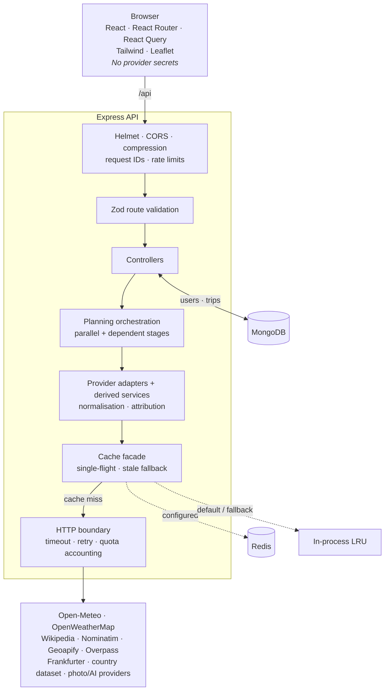

# TrailMate

**A resilient, full-stack travel planner that brings weather, places, maps, currency, country context, budgets, packing guidance, and a grounded trip briefing into one editorial dashboard.**

TrailMate is a MERN monorepo built around a practical integration problem: several external providers expose different schemas, availability guarantees, and quotas, but the user should see one consistent product. The Express API proxies and normalises provider data, protects credentials, caches aggressively, and returns independent sections so one failed source does not break the entire plan.

<p align="center">
  <em>React 19 · Vite 8 · Tailwind CSS 4 · Express 5 · MongoDB · Redis · Leaflet</em>
</p>

> Screenshots are not currently committed. See the [capture checklist](docs/screenshots/README.md) for the expected files and routes.

## Contents

- [Product overview](#product-overview)
- [Quick start](#quick-start)
- [Architecture](#architecture)
- [How planning works](#how-planning-works)
- [Client routes](#client-routes)
- [API reference](#api-reference)
- [Providers and fallbacks](#providers-and-fallbacks)
- [Configuration](#configuration)
- [Scripts](#scripts)
- [Testing and CI](#testing-and-ci)
- [Docker](#docker)
- [Deployment](#deployment)
- [Security, resilience, and accessibility](#security-resilience-and-accessibility)
- [Project structure](#project-structure)
- [Known limitations](#known-limitations)
- [Troubleshooting](#troubleshooting)
- [Additional documentation](#additional-documentation)
- [License](#license)

## Product overview

Enter a destination and optional dates. TrailMate builds a dashboard containing:

| Area | What it provides |
| --- | --- |
| Weather | Normalised current conditions and a bounded daily forecast, with rain, UV, and wind context. |
| Places | Ranked attractions and restaurants with descriptions, photography, distance, and attribution. |
| Map | Leaflet markers synchronised with the selected place. |
| Currency | ECB reference-rate conversion and an optional historical series. |
| Country context | Languages, currency, flag, calling code, local time, capital, driving side, and practical facts. |
| Budget | A transparent estimate based on destination, duration, travellers, and travel style. |
| Packing | Rule-derived items with the reason each recommendation was included. |
| Briefing | A provider-backed or deterministic summary grounded in the dashboard data. |
| Climate | Monthly normals and comfort scoring for seasonal perspective. |

The application also includes:

- two-to-eight-stop multi-city itineraries with estimated travel legs;
- URL-persisted plans and multi-city navigation that survive refresh and browser history;
- authenticated trip snapshots, notes, packing progress, refresh, and deletion;
- revocable public read-only share links;
- an editorial responsive interface with light, dark, and system themes;
- Celsius/Fahrenheit and kilometre/mile preferences;
- accessible destination search, keyboard navigation, focus treatment, and reduced-motion support; and
- live provider usage and cache statistics.

The core destination sections arrive through `GET /api/plan`. Autocomplete, climate data, mutations, and explicit refresh actions use their own focused endpoints; “one dashboard” does not mean every interaction is one HTTP request.

## Quick start

### Requirements

- Node.js **20.19 or newer**
- npm
- MongoDB for accounts, saved trips, sharing, and seed data
- Redis only if you want a shared cache; the default is an in-process LRU

All third-party API keys are optional. Open-Meteo, Wikipedia/OpenStreetMap, Frankfurter, the country dataset, a placeholder-photo source, and the deterministic briefing engine provide a keyless path.

### Install and run

```bash
npm install
```

Copy the server environment template:

```bash
# macOS or Linux
cp server/.env.example server/.env
```

```powershell
# Windows PowerShell
Copy-Item server/.env.example server/.env
```

Generate a development JWT secret and place it in `server/.env`:

```bash
node -e "console.log(require('crypto').randomBytes(48).toString('hex'))"
```

Then start both workspaces:

```bash
npm run dev
```

| Service | URL |
| --- | --- |
| Client | <http://localhost:5173> |
| API health | <http://localhost:5000/api/health> |

The API has safe development defaults and can start without MongoDB. In that degraded mode, planning still works, while auth and saved-trip operations return `503 DATABASE_UNAVAILABLE` and the client displays a warning. Set `MONGODB_URI` to enable the complete product.

### Seed demo data

With MongoDB running:

```bash
npm run seed
```

The seed is idempotent. It creates or reuses `demo@trailmate.dev` with password `trailmate123`, builds up to three real provider-backed snapshots, and shares the first newly created trip. Reset only the demo account and its trips with:

```bash
npm run seed -- --reset
```

Do not use the seed script against production; it refuses to run when `NODE_ENV=production`.

## Architecture



### Responsibilities

| Layer | Responsibility |
| --- | --- |
| `client/src/api/` | Axios boundary, endpoint wrappers, and React Query keys. |
| `client/src/hooks/` | URL parameters, plan queries, debounce, and time helpers. |
| `client/src/components/` | Shared layout, accessible controls, maps, and independently resilient cards. |
| `server/src/routes/` | Central API map and route-specific middleware order. |
| `server/src/controllers/` | Translate validated HTTP intent into service calls and response envelopes. |
| `server/src/services/` | Provider adapters, orchestration, normalisers, and derived budget/packing/briefing features. |
| `server/src/cache/` | Redis or memory storage, read-through caching, single-flight requests, and stale fallback. |
| `server/src/lib/` | Typed errors, HTTP policy, geographic calculations, logging, usage accounting, and tokens. |
| `server/src/models/` | Mongoose user and trip schemas, indexes, methods, and public projections. |

The browser never calls external data providers directly. That keeps secrets out of the bundle, centralises retry/fallback policy, and prevents provider schemas from leaking into UI components.

## How planning works

A typical core request is:

```http
GET /api/plan?city=Kyoto&days=5&style=midrange&travellers=1&radius=5000
```

1. **Validate input.** Zod checks city names, dates, currencies, enums, and numeric bounds before provider work begins.
2. **Resolve the destination.** A cached geocode lookup produces coordinates, country metadata, and timezone. Without coordinates, the plan cannot continue.
3. **Fan out independent work.** Weather, places, country, and photo sections use `Promise.allSettled()` so one rejection does not erase successful sections.
4. **Resolve dependencies.** Currency and budget depend on country data; packing and briefing depend on earlier normalised sections.
5. **Cache provider work.** Fresh hits return immediately. Concurrent misses for one key share a promise. A failed refresh may return a retained stale value with explicit degraded metadata.
6. **Normalise output.** Provider-specific codes and fields become TrailMate’s internal vocabulary before reaching a controller or client.
7. **Return section envelopes.** Each section independently contains success data or a safe error. The plan returns `200` when all requested sections succeed and may return `207 Multi-Status` for partial success.
8. **Render independently.** `SectionCard` presents loading, ready, empty, and retryable failure states without collapsing the rest of the page.

### Multi-city persistence

Submitted itinerary parameters are serialised into the URL and queried through React Query. Opening a stop passes repeated route parameters into `/plan`, enabling Back-to-itinerary, Previous, Next, direct-stop navigation, refresh restoration, and browser Back/Forward without losing or mismatching the route.

Travel legs use great-circle distance, a routing factor, and mode-specific overhead. They are estimates—not live road, rail, or flight schedules.

### Saved trips

`POST /api/trips` accepts trip intent, not a client-supplied snapshot. The server rebuilds the plan through its trusted service layer and stores the resulting normalised snapshot. Public links read that snapshot without provider calls and omit owner identity and internal share metadata.

## Client routes

| Route | Access | Purpose |
| --- | --- | --- |
| `/` | Public | Editorial landing page and trip search. |
| `/plan?...` | Public | Live destination dashboard. |
| `/multi-city?...` | Public | URL-persisted multi-city itinerary builder. |
| `/share/:token` | Public | Read-only shared snapshot. |
| `/login` | Guest only | Sign in and return to the originally requested route. |
| `/register` | Guest only | Create an account. |
| `/trips` | Authenticated | Search, sort, paginate, and delete saved trips. |
| `/trips/:id` | Authenticated | View, refresh, edit, share, or delete one snapshot. |
| `/settings` | Authenticated | Profile, password, display preferences, and provider-usage view. |

Unknown routes render the client’s not-found page. In production, Express or Nginx supplies an SPA history fallback so direct navigation still reaches React Router.

## API reference

Base path: `/api`.

Most successes use `{ success: true, data, meta }`. Failures use `{ success: false, error: { code, message, details?, requestId } }`.

### Health and metadata

| Method | Path | Purpose |
| --- | --- | --- |
| `GET` | `/health` | API, database, and cache status without contacting providers. |
| `GET` | `/health/live` | Dependency-free liveness probe. |
| `GET` | `/health/ready` | Readiness state. |
| `GET` | `/meta/usage` | Provider call budgets and cache statistics. |
| `GET` | `/meta/config` | Public provider names, feature flags, and supported options. |

### Discovery and provider proxies

| Method | Path | Purpose |
| --- | --- | --- |
| `GET` | `/search?q=` | Destination autocomplete. |
| `GET` | `/weather/:city?days=` | Normalised weather. |
| `GET` | `/places/:city?radius=&limit=` | Attractions and restaurants. |
| `GET` | `/currency/list` | Supported currencies. |
| `GET` | `/currency?from=&to=&amount=&series=` | Conversion and optional series. |
| `GET` | `/country` | Trimmed country list. |
| `GET` | `/country/:name` | Country facts by name or code. |
| `GET` | `/photo/:city` | Destination photo and attribution metadata. |
| `GET` | `/climate/:city?years=` | Monthly climate normals. |

### Planning

| Method | Path | Purpose |
| --- | --- | --- |
| `GET` | `/plan?...` | Composite destination plan with independently resolved sections. |
| `POST` | `/plan/multi-city` | Two-to-eight-stop route and estimated legs. |
| `GET` | `/packing?...` | Rule-derived packing list. |
| `GET` | `/budget/styles` | Supported travel styles and multipliers. |
| `GET` | `/budget?...` | Transparent budget estimate. |
| `POST` | `/ai/summary` | Grounded provider or rules-based briefing. |

### Authentication

| Method | Path | Purpose |
| --- | --- | --- |
| `POST` | `/auth/register` | Register and receive a JWT. |
| `POST` | `/auth/login` | Authenticate and receive a JWT. |
| `GET` | `/auth/me` | Load the current account. |
| `PATCH` | `/auth/me` | Update profile and preferences. |
| `POST` | `/auth/change-password` | Change the current password. |

### Trips and sharing

All `/trips` routes require a bearer token. `/share/:token` is intentionally public.

| Method | Path | Purpose |
| --- | --- | --- |
| `GET` | `/trips?page=&limit=&sort=&q=` | Paginated saved-trip list. |
| `POST` | `/trips` | Create a server-owned snapshot. |
| `GET` | `/trips/:id` | Fetch one owned trip. |
| `PATCH` | `/trips/:id` | Update editable fields and packing progress. |
| `DELETE` | `/trips/:id` | Delete an owned trip. |
| `POST` | `/trips/:id/refresh` | Rebuild the snapshot from current providers. |
| `POST` | `/trips/:id/share` | Create or enable a public token. |
| `DELETE` | `/trips/:id/share` | Disable public access. |
| `GET` | `/share/:token` | Read the public projection. |

### Example requests

```bash
curl -s "http://localhost:5000/api/plan?city=Kyoto&days=5"
curl -s "http://localhost:5000/api/meta/config"
curl -s "http://localhost:5000/api/meta/usage"
```

Inspect cache headers by repeating a provider request:

```bash
curl -si "http://localhost:5000/api/weather/Kyoto"
curl -si "http://localhost:5000/api/weather/Kyoto"
```

Look for `X-Cache`, `Age`, `X-Data-Provider`, `X-Request-Id`, and rate-limit headers.

## Providers and fallbacks

| Domain | Keyless path | Optional upgrade | Notes |
| --- | --- | --- | --- |
| Geocoding | Open-Meteo | — | Cached for one week by default. |
| Weather | Open-Meteo | OpenWeatherMap | Internal output remains metric. |
| Attractions | Wikipedia GeoSearch | Geoapify | Overpass is a last-resort path. |
| Restaurants | Nominatim/OpenStreetMap | Geoapify | Nominatim calls are serialised to respect usage policy. |
| Currency | Frankfurter/ECB | — | Reference rates, not card or cash rates. |
| Country | `mledoze/countries` dataset | — | Cached reference data with derived fields. |
| Photos | Deterministic placeholder source | Unsplash | Provider attribution is rendered in the UI. |
| Briefing | Deterministic rules | Groq, Gemini, or Ollama | Output is schema-validated and grounded. |
| Map tiles | OpenStreetMap | — | OSM attribution remains visible. |

Optional keys upgrade one domain; exhausting or disabling an optional provider allows its fallback chain to continue.

## Configuration

### Server

Copy `server/.env.example` to `server/.env`. Important variables:

| Variable | Required? | Meaning |
| --- | --- | --- |
| `NODE_ENV` | No | `development`, `test`, or `production`. |
| `PORT` | No | API port; default `5000`. |
| `CORS_ORIGIN` | Production | Comma-separated allowed browser origins. |
| `MONGODB_URI` | Full product | MongoDB connection. Planning degrades without it. |
| `JWT_SECRET` | Production | Signing secret; production requires at least 32 characters and rejects the development fallback. |
| `JWT_EXPIRES_IN` | No | Token lifetime; default `7d`. |
| `REDIS_URL` | No | Enables Redis instead of the memory cache. |
| `CACHE_TTL_*` | No | Per-domain freshness windows. |
| `CACHE_STALE_GRACE` | No | How long expired entries remain eligible for outage fallback. |
| `CACHE_MAX_ENTRIES` | No | Memory-cache entry bound; default `1000`. |
| `UPSTREAM_TIMEOUT_MS` | No | Provider timeout; default `5000`. |
| `UPSTREAM_RETRIES` | No | Bounded retry count; default `1`. |
| `RATE_LIMIT_MAX` | No | Broad requests per configured window. |
| `AUTH_RATE_LIMIT_MAX` | No | Failed auth attempts per window. |
| `AI_RATE_LIMIT_MAX` | No | Briefing requests per window. |
| `OPENWEATHER_API_KEY` | No | Enables OpenWeatherMap weather. |
| `GEOAPIFY_API_KEY` | No | Enables Geoapify places. |
| `UNSPLASH_ACCESS_KEY` | No | Enables Unsplash photography. |
| `AI_PROVIDER` | No | `auto`, `groq`, `gemini`, `ollama`, or `rules`. |
| `GROQ_API_KEY`, `GEMINI_API_KEY` | No | Hosted model credentials. |
| `OLLAMA_BASE_URL` | No | Enables a local Ollama endpoint. |
| `QUOTA_*` | No | Local daily budgets for metered providers. |

Never place secrets in `client/.env`; every `VITE_*` value is compiled into public JavaScript.

### Client

| Variable | Meaning |
| --- | --- |
| `VITE_API_URL` | API base for split deployments. Leave empty for the Vite proxy or same-origin production. |
| `VITE_DEV_API_TARGET` | Development proxy target; default `http://localhost:5000`. |

### Docker Compose

Root `.env` configures published ports, Mongo bootstrap credentials, the container JWT secret, and optional provider keys. It is consumed by Compose, not by the application processes directly.

## Scripts

Run commands from the repository root unless noted otherwise.

| Command | Purpose |
| --- | --- |
| `npm run dev` | Start API and client development processes together. |
| `npm run dev:server` | Start only the watched API. |
| `npm run dev:client` | Start only Vite. |
| `npm run build` | Build the production client. |
| `npm start` | Start the API without watch mode. |
| `npm test` | Run the server Jest suite once. |
| `npm run test:coverage --workspace server` | Run server tests with coverage. |
| `npm run lint` | Lint both workspaces. |
| `npm run format` | Format JavaScript, JSX, JSON, Markdown, and CSS. |
| `npm run format:check` | Check formatting without modifying files. |
| `npm run seed` | Create/reuse the demo user and provider-backed snapshots. |

The client currently has no dedicated unit/component test command.

## Testing and CI

The server has six Jest suites:

| Suite | Coverage |
| --- | --- |
| `proxy.test.js` | Health, provider normalisation, cache headers, fallback, and upstream-shape regressions. |
| `cache.test.js` | Cache keys, read-through behavior, stale fallback, single-flight, fallback chains, and quotas. |
| `derived.test.js` | Packing, budget, geographic estimates, and deterministic briefing behavior. |
| `validation.test.js` | Input rejection, malformed JSON, error envelopes, and request IDs. |
| `auth.test.js` | Registration, hashing, login, profile changes, password rotation, and token rejection. |
| `trips.test.js` | Trusted snapshots, indexes, ownership, updates, deletion, sharing, and revocation. |

The documentation audit ran `npm test` successfully: **6 suites and 85 tests passed**. Counts may increase as coverage grows, so command output remains authoritative.

Nock disables external network access. HTTP interception exercises the real Axios boundary, retries, parsers, normalisers, and caches instead of replacing provider modules with mocks. Database suites try, in order:

1. `MONGODB_TEST_URI`;
2. `mongodb-memory-server`;
3. a local scratch MongoDB; or
4. a clearly reported skip when none is available.

The client is currently validated through ESLint, Prettier, production builds, and CI smoke checks. A React component or browser-level test suite has not yet been added.

### GitHub Actions

CI runs on pushes to `main`, `master`, and `develop`; pull requests targeting `main` or `master`; and manual dispatch. Its jobs are:

1. lint both workspaces and check formatting;
2. test on Node 20 and 22 with MongoDB, then build the client;
3. collect coverage;
4. boot the production API and verify health, config, SPA serving, history fallback, validation, and API `404` behavior; and
5. build and start both Docker images, then verify the Nginx-to-API proxy.

## Docker

```bash
# macOS or Linux
cp .env.example .env
```

```powershell
# Windows PowerShell
Copy-Item .env.example .env
```

Set `JWT_SECRET` in root `.env`, then run:

```bash
docker compose up --build
```

| Service | URL / role |
| --- | --- |
| `web` | <http://localhost:8080> — Nginx SPA and `/api` proxy. |
| `api` | <http://localhost:5000/api/health> — directly published for diagnostics. |
| `mongo` | Internal persistent database with a named volume. |
| `redis` | Internal disposable LRU cache. |

Both application images use multi-stage builds and health checks. The API runtime installs production dependencies only, runs as a non-root user under `tini`, and is mounted read-only by Compose with `/tmp` as `tmpfs`. The Nginx image serves immutable Vite assets, avoids caching `index.html`, supplies the SPA fallback, and keeps browser traffic same-origin through `/api`.

Stop the stack with:

```bash
docker compose down
```

Add `--volumes` only when you intentionally want to delete the local MongoDB data volume.

## Deployment

No live production URL or provider-specific deployment manifest is committed. The repository supports two patterns:

### Split frontend and API

- Build the API host with `npm ci` and start it using `npm run start --workspace server`.
- Build the client using `npm run build --workspace client`; publish `client/dist`.
- Set `VITE_API_URL` at client build time to the public API base.
- Set API `CORS_ORIGIN` to the exact frontend origin.
- Configure the static host to rewrite non-file routes to `/index.html`.

### Same-origin process

If `client/dist/index.html` exists and the API runs with `NODE_ENV=production`, Express serves the bundle with long-lived asset caching and a client-route fallback. The provided Compose stack instead uses separate API and Nginx containers on one origin.

Production must provide:

- a non-default `JWT_SECRET` of at least 32 characters;
- a durable MongoDB deployment;
- the correct CORS/proxy configuration;
- secret management outside committed files; and
- provider terms, quotas, and attribution review.

Redis is recommended when more than one API process should share cached values. The in-flight map and quota counters remain process-local even when Redis stores cached entries.

## Security, resilience, and accessibility

### Security

- Passwords use bcrypt with 12 rounds and are excluded from normal queries and JSON output.
- Unknown-email and wrong-password login paths use a decoy hash and the same public error.
- JWTs carry a subject ID; protected requests reload the current user.
- Other users’ trip IDs return `404` rather than confirming resource existence.
- Share tokens use 24 random bytes encoded as base64url, and public projections remove owner/share internals.
- Helmet, production CSP, a CORS allowlist, body-size limits, request IDs, and central error envelopes are enabled.
- A broad limiter covers `/api`; auth, AI, and high-cost trip create/refresh routes add tighter policies.
- Routes that accept user-controlled parameters or bodies apply Zod validation and bounded inputs.

### Resilience

- Redis is optional; memory caching keeps local setup and degraded operation simple.
- Stale values are visibly marked rather than silently presented as live.
- Provider chains skip disabled or locally exhausted metered sources.
- Planning continues when MongoDB is unavailable.
- The AI feature falls back to deterministic rules.
- External provider errors are client-safe and include request IDs for log correlation.

### Accessibility and interface

- The redesigned client uses a warm paper/forest editorial system with a full dark equivalent.
- Destination search follows the ARIA combobox pattern and supports arrows, Enter, Escape, and Tab.
- Labels bind to their controls; auth failures are associated and announced.
- The app includes a skip link, visible focus indicators, semantic landmarks, and independent loading announcements.
- Progress indicators expose ARIA values, maps and charts have supporting text/table information, and reduced motion is respected globally.
- Provider photography and map/place sources retain visible attribution.

## Project structure

```text
TrailMate/
├── client/
│   ├── src/
│   │   ├── api/                 # Axios client, endpoints, query keys
│   │   ├── components/
│   │   │   ├── cards/           # Dashboard cards and map
│   │   │   ├── layout/          # Header and footer
│   │   │   ├── search/          # Accessible destination search
│   │   │   └── ui/              # Shared cards, badges, skeletons, icons
│   │   ├── context/             # Auth, preferences, toasts
│   │   ├── hooks/               # Plan/URL queries and utility hooks
│   │   ├── lib/                 # Formatting and unit conversion
│   │   ├── pages/               # Landing, plan, route, auth, trip pages
│   │   ├── App.jsx              # Routes, auth gates, lazy loading
│   │   └── main.jsx             # Provider/bootstrap order
│   ├── Dockerfile
│   └── nginx.conf
├── server/
│   ├── src/
│   │   ├── cache/               # Facade, memory, Redis
│   │   ├── config/              # Environment and MongoDB
│   │   ├── controllers/         # HTTP orchestration
│   │   ├── lib/                 # Errors, HTTP, geo, usage, tokens, logs
│   │   ├── middleware/          # Auth, validation, limits, errors
│   │   ├── models/              # User and Trip
│   │   ├── routes/              # Complete API route table
│   │   ├── services/            # Providers, orchestration, derived features
│   │   └── validators/          # Zod request schemas
│   ├── scripts/seed.js
│   ├── tests/                   # Six server suites and helpers
│   └── Dockerfile
├── docs/
│   ├── INTERVIEW_PREPARATION.md
│   └── screenshots/README.md
├── .github/workflows/ci.yml
├── .env.example                 # Compose variables
├── docker-compose.yml
├── package.json                 # npm workspaces and root scripts
└── README.md
```

## Known limitations

- The client has no dedicated React component or end-to-end browser suite.
- Quota counters and the single-flight promise map are process-local.
- Redis shares cached values but does not currently provide distributed locking.
- Multi-city legs are heuristics, not booking-grade routes or timetables.
- Saved trips are snapshots and can become stale until explicitly refreshed.
- Provider schemas, fair-use policies, availability, and quotas remain external dependencies.
- The rule-based briefing prioritises grounding and availability over model-level creativity.
- No live deployment, committed screenshots, or provider-specific cloud manifests are included.

See [the interview guide](docs/INTERVIEW_PREPARATION.md#24-honest-limitations-and-next-improvements) for suggested next steps.

## Troubleshooting

### Accounts are offline but planning works

MongoDB is unavailable. Start a local MongoDB instance or set `MONGODB_URI` to a reachable deployment. Check `<http://localhost:5000/api/health>` for the reported database state.

### A database test prints a MongoDB download warning

`mongodb-memory-server` downloads a MongoDB binary on first use. In a network-restricted environment, provide `MONGODB_TEST_URI` or run a local MongoDB instance. The helper then uses that database and avoids the download path.

### Port 5000 or 5173 is already in use

Change `PORT` in `server/.env`; if the API port changes, also set `VITE_DEV_API_TARGET` in `client/.env`. Vite can choose a different client port automatically, and development CORS accepts localhost ports.

### Optional provider calls are failing

Remove the optional key to return to the keyless provider, inspect the request ID in server logs, and check `/api/meta/config` plus `/api/meta/usage`. Do not place provider keys in client environment files.

### A direct client route returns a web-server 404

Configure an SPA fallback to `index.html`. The provided Nginx configuration and Express production serving already include one; third-party static hosts need an equivalent rewrite.

### Docker Compose rejects the configuration

Create root `.env` from `.env.example` and set `JWT_SECRET`. Validate substitutions before booting:

```bash
docker compose config
```

## Additional documentation

- [Interview preparation guide](docs/INTERVIEW_PREPARATION.md) — architecture, code-reading map, trade-offs, interview questions, study roadmap, and demo checklist.
- [Screenshot and demo capture guide](docs/screenshots/README.md) — expected assets and reproducible capture guidance.

## License

The package metadata declares the project as MIT. A root `LICENSE` file is not currently committed; add the full licence text and copyright holder before relying on or distributing the repository under those terms.

Third-party data and imagery remain under their respective terms. TrailMate preserves visible attribution for OpenStreetMap, Wikipedia, and provider photography where required.
