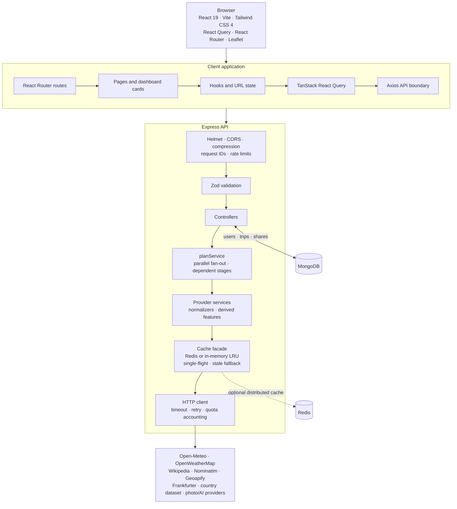

# TrailMate Interview Preparation Guide

This guide explains what TrailMate is, how it works, why the architecture was designed this way, what technologies are used, and what to study before presenting it in an interview. It is written from the implementation in this repository, not as a generic MERN tutorial.

Use it in three ways:

1. Read the **project story** and **architecture** sections to understand the system.
2. Use the **interview answers** section to rehearse concise responses.
3. Follow the **study roadmap** and **demo checklist** to turn the repository into a confident live explanation.

> Important honesty rule: describe what the code actually does. Do not claim that the project has a frontend unit-test suite, a production deployment, a real route-planning engine, or globally distributed quota tracking unless you add and verify those capabilities. The package metadata declares MIT, but no root `LICENSE` file or screenshot assets are currently committed.

## Contents

- [Project story and user experience](#1-the-project-in-one-sentence)
- [Architecture and technology stack](#4-architecture-overview)
- [Repository reading map](#6-repository-map-where-to-read-the-code)
- [Request and provider flows](#7-the-request-lifecycle-in-detail)
- [Caching, data, security, and frontend state](#9-caching-and-resilience)
- [Derived features, API contracts, and testing](#13-derived-features)
- [Docker, CI, and trade-offs](#16-docker-nginx-and-ci)
- [Interview questions](#18-interview-questions-and-strong-answers)
- [Study and rehearsal plan](#20-study-roadmap)
- [Demo, commands, limitations, and cheat sheet](#22-demo-checklist)

---

## 1. The project in one sentence

**TrailMate is a full-stack MERN travel planner that turns a destination into one resilient dashboard containing weather, attractions, food, maps, currency, country facts, budget estimates, climate guidance, packing recommendations, and a grounded trip briefing.**

The interesting engineering problem is not displaying a weather card. It is combining several unreliable and differently shaped external APIs into one predictable product while protecting free-tier quotas and keeping partial failures visible instead of silently corrupting the page.

---

## 2. The 30-second interview introduction

> “I built TrailMate, a MERN travel-planning application. A user searches for a city and the frontend calls one backend planning endpoint. The Express service resolves the destination, fans out to weather, places, country, currency, photo, budget, packing, and AI services, normalizes every provider response into an internal schema, and returns independent sections so one provider failure does not break the entire dashboard. I added a cache abstraction with Redis or an in-memory LRU fallback, request coalescing, stale-on-failure behavior, provider fallbacks, rate limits, quota tracking, JWT authentication, MongoDB trip snapshots, and public read-only share links. The React client uses URL-driven state and React Query, so dashboards and multi-city itineraries survive refresh and browser navigation.”

That answer gives the interviewer several useful follow-up paths: API design, caching, resilience, React state, security, MongoDB modeling, testing, and deployment.

---

## 3. The product problem and the user experience

### The user problem

Travel planning normally means opening several websites and manually combining:

- weather forecasts;
- attractions and restaurants;
- country and currency information;
- travel costs;
- packing decisions; and
- itinerary notes.

TrailMate presents those concerns as one destination dashboard.

### Main user journey

1. The user enters a city on the landing page.
2. The client navigates to a URL such as `/plan?city=Kyoto&days=5`.
3. React Query requests `GET /api/plan`.
4. The server geocodes the city and uses the coordinates as the common input for downstream services.
5. Independent sections are fetched in parallel where possible.
6. The server normalizes provider-specific responses.
7. The client renders each dashboard card independently.
8. A user can change display units, save a snapshot, tick packing items, refresh live data, or share a read-only trip link.

### Product features

| Feature | Description |
| --- | --- |
| Destination search | City autocomplete with region, country, and population information. |
| Weather | Current conditions and a bounded forecast in a single internal metric schema. |
| Places | Attractions plus restaurants/cafés, ranked and categorized. |
| Map | Leaflet map with synchronized points of interest. |
| Country facts | Language, currency, flag, capital, calling code, timezone-related display, and driving side. |
| Currency | Exchange-rate conversion and a historical series where available. |
| Budget | A transparent estimate based on country index, city premium, travel style, duration, and travelers. |
| Packing | Rule-based recommendations with a reason for each item. |
| AI briefing | Provider-backed or deterministic rule-based trip summary grounded in the dashboard data. |
| Multi-city itinerary | Two to eight destinations with estimated travel legs. |
| Saved trips | Authenticated server-owned snapshots, editable notes/tags, packing progress, and refresh. |
| Sharing | Public read-only links without exposing the owner. |
| Preferences | Theme, temperature units, distance units, and home currency. |
| Editorial interface | Responsive warm-paper/forest visual system, photographic destination surfaces, dark-mode equivalent, visible focus states, and reduced-motion support. |

---

## 4. Architecture overview

TrailMate is a monorepo with a React/Vite client and an Express/Mongoose API. The browser never calls third-party providers directly.



### Architectural principle

The architecture keeps external-provider complexity on the server side:

```text
Browser
  -> one stable TrailMate API
      -> validation
      -> controllers
      -> service layer
      -> cache and resilience layer
      -> external providers
```

This gives the frontend one contract and prevents:

- API keys from entering the browser bundle;
- provider-specific CORS problems;
- provider response shapes leaking into UI components;
- every browser having to implement retry and fallback logic; and
- a provider change forcing a frontend rewrite.

---

## 5. Technology stack

### 5.1 Frontend

| Technology | Role | What to study |
| --- | --- | --- |
| React 19 | Component-based UI and hooks | Components, props, state, effects, memoization, controlled inputs, error boundaries. |
| Vite 8 | Development server and production bundler | ESM, dev server, build pipeline, environment variables, code splitting. |
| React Router 7.x | Client-side routing | Routes, nested navigation concepts, location state, search parameters, SPA history fallback. |
| TanStack React Query 5 | Server-state fetching and caching | Query keys, stale time, cache lifetime, loading/error states, invalidation, mutations. |
| Axios | Browser HTTP client | Interceptors, request configuration, error normalization, cancellation/timeouts. |
| Tailwind CSS 4 | Utility-first styling | Responsive utilities, dark-mode classes, component composition, design consistency. |
| Leaflet | Interactive map | Coordinates, markers, bounds, tile providers, map lifecycle. |
| React Leaflet | React integration for Leaflet | Declarative map components and controlled map data. |
| ESLint | Static analysis | React hooks rules, compiler-oriented rules, lint as design feedback. |

Important frontend implementation choices:

- The URL is the source of truth for dashboard parameters.
- React Query keys are derived from those parameters.
- A shared Axios boundary converts raw Axios errors into `TrailMateError` objects.
- Display units are client concerns; the API returns metric values consistently.
- Lazy routes reduce the initial bundle for trips, sharing, settings, login, and multi-city pages.
- The application has an error boundary, skeleton states, section-level error states, accessible search, keyboard navigation, focus styling, and reduced-motion support.

### 5.2 Backend

| Technology | Role | What to study |
| --- | --- | --- |
| Node.js 20.19+ | JavaScript runtime | Event loop, asynchronous I/O, promises, ESM, process signals. |
| Express 5.2 | HTTP framework | Middleware order, routers, handlers, error middleware, request/response lifecycle. |
| Mongoose 8.24 | MongoDB ODM | Schemas, indexes, middleware, virtuals, projections, model methods. |
| MongoDB 7 | Persistent document database | Documents, indexes, ObjectIds, query patterns, denormalized snapshots. |
| Zod 3.25 | Runtime validation | Parsing, coercion, refinements, safe parsing, validation error structures. |
| Axios 1.19 | Server-side upstream HTTP client | Timeouts, retries, status handling, response normalization. |
| Redis / ioredis | Optional distributed cache | TTLs, key/value storage, LRU policies, availability tradeoffs. |
| JSON Web Token | Stateless access token | Signing, verification, expiry, bearer authentication, token limitations. |
| bcryptjs | Password hashing | Salt rounds, password verification, why passwords are never encrypted reversibly. |
| Helmet | Security headers | CSP, clickjacking protection, MIME sniffing protection. |
| CORS | Browser origin policy | Allowlists, credentials, development versus production origins. |
| compression | Response compression | Payload size and network cost. |
| morgan | HTTP access logging | Request timing, request IDs, cache headers in logs. |
| express-rate-limit | Request throttling | Per-IP limits, route-specific policies, abuse protection. |

The backend is ESM because `server/package.json` declares `"type": "module"`. The application is split into an app factory and a process bootstrap:

- `server/src/app.js` creates and configures Express without listening.
- `server/src/server.js` connects the database, starts the listener, and handles graceful shutdown.

That separation makes Supertest integration tests possible without opening a real application port.

### 5.3 Testing and delivery

| Technology | Role |
| --- | --- |
| Jest 30 | Server unit and integration test runner. |
| Supertest | HTTP-level testing of the Express app. |
| Nock | HTTP interception and network isolation for upstream providers. |
| mongodb-memory-server | Local database fallback for database-backed tests. |
| ESLint and Prettier | Static quality and formatting checks. |
| GitHub Actions | CI for quality, tests, build, smoke checks, and Docker. |
| Docker Compose | Local orchestration of MongoDB, Redis, API, and web containers. |
| Nginx | Static SPA serving and `/api` reverse proxy in the web image. |

There is currently a server-focused test suite. The client has linting and production build validation, but no dedicated frontend unit-test suite should be claimed unless one is added.

---

## 6. Repository map: where to read the code

```text
TrailMate/
├── client/
│   ├── src/
│   │   ├── api/              Axios boundary, endpoint wrappers, query keys
│   │   ├── components/       Reusable UI and dashboard cards
│   │   ├── context/          Authentication, preferences, toasts
│   │   ├── hooks/            URL parameters, plan queries, time/debounce helpers
│   │   ├── lib/              Formatting and unit conversion
│   │   ├── pages/            Landing, plan, multi-city, trips, auth, share
│   │   ├── App.jsx           Router, lazy routes, auth gates
│   │   └── main.jsx          React application bootstrap
│   ├── Dockerfile             Multi-stage build and Nginx runtime
│   └── nginx.conf              SPA fallback, security headers, API proxy
├── server/
│   ├── src/
│   │   ├── app.js             Express app factory
│   │   ├── server.js           Runtime bootstrap and shutdown
│   │   ├── cache/              Cache facade, memory store, Redis store
│   │   ├── config/             Environment and database configuration
│   │   ├── controllers/        HTTP-to-service orchestration
│   │   ├── lib/                Errors, HTTP, geo, logging, quotas, tokens
│   │   ├── middleware/         Auth, validation, rate limiting, errors
│   │   ├── models/             User and Trip schemas
│   │   ├── routes/              Central route table
│   │   ├── services/            Provider adapters and derived features
│   │   └── validators/          Request schemas
│   ├── tests/                   Jest, Supertest, Nock, DB helpers, fixtures
│   ├── scripts/seed.js          Demo data seed script
│   └── Dockerfile               Production API image
├── docs/
│   ├── INTERVIEW_PREPARATION.md This guide
│   └── screenshots/README.md    Capture checklist; image assets are not committed
├── .github/workflows/ci.yml     GitHub Actions pipeline
├── docker-compose.yml           Full local stack
├── package.json                 Root workspace scripts
└── README.md                    Product and engineering documentation
```

### Files worth opening during an interview

1. `server/src/services/planService.js` — central orchestration and partial-failure model.
2. `server/src/cache/index.js` — stale fallback, single-flight, provider fallback.
3. `server/src/routes/index.js` — complete API and middleware ordering.
4. `server/src/app.js` — security, CORS, parsing, static serving, error flow.
5. `server/src/config/env.js` — validated configuration and provider selection.
6. `server/src/models/User.js` — password hashing and serialization protection.
7. `server/src/models/Trip.js` — snapshot design, indexes, sharing, virtuals.
8. `client/src/hooks/usePlan.js` — URL state plus React Query.
9. `client/src/api/client.js` — the browser’s single network boundary.
10. `client/src/pages/MultiCityPage.jsx` and `client/src/pages/PlanPage.jsx` — URL-persisted itinerary navigation.
11. `server/tests/cache.test.js` — resilience behavior tests.
12. `server/tests/trips.test.js` — server-owned snapshots and sharing security.

---

## 7. The request lifecycle in detail

### 7.1 Dashboard request

Example:

```http
GET /api/plan?city=Kyoto&days=5&style=midrange&travellers=1&radius=5000
```

#### Step 1: Browser state

`useTripParams()` reads the URL using React Router’s `useSearchParams`. The URL becomes the durable representation of the current destination and options.

The hook creates a normalized query payload. `usePlan()` uses that payload in both:

- the React Query key; and
- the Axios request.

This prevents a common bug where the displayed destination and cached data disagree.

#### Step 2: Express middleware

The request passes through:

1. global security and response middleware;
2. request ID middleware;
3. broad API rate limiting;
4. optional authentication for planning routes;
5. Zod request validation;
6. the controller.

Validation happens before expensive work. Numeric ranges, enum values, currency codes, dates, city names, and included sections are checked before an upstream provider is called.

#### Step 3: Destination resolution

`buildTripPlan()` first calls `resolveCity()`.

This is the only mandatory stage because downstream calls need coordinates. If geocoding fails, the request returns a destination error. If weather fails, the weather section can fail while the rest of the page remains useful.

The resolved location becomes the shared input for weather, places, country, and photo services.

#### Step 4: Parallel independent work

The service uses `Promise.allSettled()` for independent sections:

- weather;
- places;
- country; and
- photo.

`Promise.allSettled()` is important here. `Promise.all()` would reject the entire group when one provider fails. `allSettled()` gives every result a status that can be converted into a section envelope.

#### Step 5: Dependent work

Currency needs the destination country’s primary currency, so it runs after country resolution.

Budget needs the location, country, duration, travelers, style, and home currency.

Packing is derived from normalized weather, country, places, trip duration, and activities.

The AI summary runs last because it consumes the already-normalized data. It does not independently browse the web.

#### Step 6: Section contract

A successful section looks conceptually like:

```json
{
  "ok": true,
  "data": { "...": "normalized data" },
  "meta": {
    "cached": true,
    "stale": false,
    "degraded": false,
    "provider": "open-meteo",
    "ageSeconds": 42
  },
  "error": null
}
```

A failed section looks like:

```json
{
  "ok": false,
  "data": null,
  "meta": null,
  "error": {
    "code": "UPSTREAM_ERROR",
    "message": "Places is temporarily unavailable. Try again in a moment.",
    "status": 502,
    "retryable": true
  }
}
```

The overall response includes health information:

```json
{
  "requested": ["weather", "places", "country", "photo", "currency", "budget", "packing", "ai"],
  "failed": ["places"],
  "degraded": [],
  "allOk": false
}
```

The API can return `200` when all sections are successful or `207 Multi-Status` when some sections fail. The response still has a usable section map in either case.

#### Step 7: Frontend rendering

The dashboard does not have one global “all data loaded” assumption. Cards consume their own section state through `useSection()`.

That means:

- weather can render while places is loading;
- a stale weather response can show a degraded badge;
- a failed card can show a retry button; and
- other cards do not disappear because one provider failed.

### 7.2 Multi-city request

```http
POST /api/plan/multi-city
Content-Type: application/json

{
  "cities": ["Kyoto", "Tokyo", "Osaka"],
  "nightsPerStop": 2,
  "homeCurrency": "USD",
  "style": "midrange"
}
```

The server:

1. validates that there are two to eight cities;
2. builds a plan for each city with the selected sections;
3. uses `Promise.allSettled()` so one unresolved stop does not automatically destroy all resolved stops;
4. computes travel legs between consecutive resolved locations;
5. uses `estimateTravel()` for straight-line distance, routing factor, mode, and door-to-door duration;
6. returns stops, legs, totals, and unresolved destinations.

The result is labeled as an estimate, not a real booking or routing result.

The client stores submitted multi-city parameters in the URL and uses a React Query key based on those parameters. That solves two state problems:

- opening a destination dashboard no longer destroys the itinerary state;
- browser Back, explicit “Back to itinerary,” and refresh can restore or recreate the itinerary.

Each stop dashboard receives route context and offers:

- previous stop;
- next stop;
- direct stop selection; and
- return to the itinerary.

### 7.3 Save-trip request

The client sends trip intent, such as city, dates, style, and traveler count. It does not send an authoritative weather or places snapshot.

The server calls the planning service itself, then stores the normalized result. This is a trust boundary: the client cannot inject a fake temperature, budget, or country payload into a saved trip.

The stored trip is a historical snapshot. Reopening it shows what was captured, and refresh is an explicit action.

### 7.4 Share request

An authenticated user requests sharing. The server generates 24 random bytes and encodes them as a URL-safe token.

The public route:

```http
GET /api/share/:token
```

is outside the authentication middleware. It returns a read-only projection that removes `userId` and the internal share record.

Revoking sharing disables future public access.

---

## 8. External API integration strategy

### Provider adapter pattern

Each provider domain is isolated behind service modules and normalisers. A domain service may coordinate several upstream sources—for example, the places service combines Wikipedia, Nominatim, optional Geoapify, and an Overpass fallback. The service layer owns:

- provider-specific URLs and parameters;
- provider-specific response parsing;
- validation of upstream shapes;
- normalisation into TrailMate’s internal schema;
- cache keys and TTLs; and
- provider metadata and attribution.

The rest of the application does not need to know whether weather came from Open-Meteo or OpenWeatherMap.

### Provider table

| Domain | Primary/keyless strategy | Optional upgrade or fallback | Internal result |
| --- | --- | --- | --- |
| Geocoding | Open-Meteo geocoding | No optional upgrade | Location with coordinates, country, timezone, and label. |
| Weather | Open-Meteo | OpenWeatherMap when key exists | Metric current conditions and daily forecast. |
| Attractions | Wikipedia GeoSearch and article metadata | Geoapify when key exists; Overpass last resort | Categorized attractions with coordinates, descriptions, and images. |
| Restaurants | Nominatim/OpenStreetMap | Geoapify where configured | Food places normalized into shared place shape. |
| Currency | Frankfurter / ECB reference rates | None required | Rate, inverse rate, converted amount, optional series. |
| Country | mledoze/countries dataset via CDN | Derived flag/map/driving-side fields | Country facts, currencies, languages, codes. |
| Cover photo | Deterministic Picsum placeholder | Unsplash when key exists | URL, thumbnail, provider, attribution/placeholder state. |
| AI briefing | Deterministic rule engine | Groq, Gemini, or Ollama | Validated grounded summary schema. |
| Map tiles | OpenStreetMap tiles | None required | Leaflet map background. |

### Why keyless-first?

The application should be usable after clone and install without waiting for multiple third-party API approvals. Optional keys improve one provider without making the whole product fail.

This also improves development and evaluation:

- reviewers can run the application with minimal setup;
- tests can exercise provider chains deterministically;
- a missing key is a configuration choice, not a broken deployment; and
- the product can survive a paid provider quota exhaustion.

### Normalization example

Different weather APIs may use different condition vocabularies:

```text
OpenWeather condition ID 500 -> rain
Open-Meteo WMO code 61       -> rain
```

The frontend sees one closed internal vocabulary. It does not branch on provider codes.

### Output validation matters

HTTP status is not enough. An upstream API can return `200` with a deprecation message, an error object, or an unexpected shape.

The country service includes a sanity check so a successful HTTP status cannot become a country object full of null fields. This protects dependent currency and budget features from silent corruption.

---

## 9. Caching and resilience

The cache facade in `server/src/cache/index.js` is one of the strongest interview topics in the project.

### 9.1 Cache key normalization

`cacheKey(namespace, params)`:

- removes empty values;
- converts values consistently;
- sorts object keys;
- lowercases values where appropriate; and
- hashes very long keys.

Therefore these logically equivalent parameter objects produce the same key:

```js
{ lat: 1, lon: 2 }
{ lon: 2, lat: 1 }
```

### 9.2 Read-through cache

The caller asks the cache wrapper for a key. The wrapper:

1. reads an existing envelope;
2. returns a fresh value when available;
3. calls the fetcher on a miss;
4. stores the successful value with a TTL; and
5. returns metadata describing freshness and provenance.

### 9.3 Single-flight request coalescing

A process-local `inflight` map stores the promise currently fetching a key.

If eight concurrent requests miss the same key:

```text
request 1 -> starts upstream call
request 2 -> joins promise
request 3 -> joins promise
...
request 8 -> joins promise
```

Only one upstream call is made in that process. This prevents a traffic spike from multiplying free-tier usage.

Interview nuance: this is process-local. In a multi-instance deployment, each instance can still have its own in-flight map. Redis provides shared cache state, but cross-instance distributed locking would be a further enhancement if strict global coalescing were required.

### 9.4 Stale-on-failure

An entry is retained beyond its fresh TTL for a stale grace period. If a refresh fails and an older value exists, the cache returns that value with:

- `cached: true`;
- `stale: true`;
- `degraded: true`; and
- a warning explaining that live data was unavailable.

This makes a provider outage visible without making the entire card unusable.

### 9.5 Provider fallback

`wrapWithFallback()` receives ordered providers. A provider can be disabled because it has no key or has exhausted its quota. The cache layer tries enabled providers in order and records:

- the provider that succeeded;
- whether fallback was used; and
- attempted provider outcomes.

### 9.6 Redis versus memory

- Redis is used when `REDIS_URL` is configured.
- The in-process LRU is used otherwise.
- If Redis becomes persistently unhealthy, the facade downgrades to memory.

The cache is disposable. Losing it costs latency and upstream calls, but not business data. That is why Redis is not treated like the primary database.

### 9.7 Quota accounting

`apiUsage.js` records metered calls by provider and exposes remaining quota and usage percentages. Services avoid a provider once its configured budget is exhausted.

Important limitation to state honestly: the quota counters are process-local in the current implementation. In a horizontally scaled production system, quota accounting should move to a shared store such as Redis or a provider-side usage system.

---

## 10. MongoDB data model

### User document

The `User` model contains:

- name;
- normalized lowercase email;
- bcrypt password hash;
- home currency;
- display preferences; and
- timestamps/login metadata.

The `passwordHash` field is `select: false` and is removed again in `toJSON`.

A `pre('save')` hook hashes new or changed passwords. Controllers do not need to remember to hash manually.

### Trip document

The `Trip` model contains:

- `userId` reference;
- title and destination point;
- optional dates, notes, and tags;
- cover photo attribution;
- normalized snapshot fields;
- materialized packing list and progress;
- optional multi-city stops and travel legs; and
- share metadata.

### Why store snapshots?

A live trip that recalculates on every open would:

- change historical plans unexpectedly;
- spend provider quota every time someone opens a shared link;
- make shared content unstable; and
- make it difficult to explain what the user originally saved.

A snapshot provides reproducibility. Refresh is explicit.

### Important indexes

- `{ userId: 1, createdAt: -1 }` supports newest-first trip listings for one user.
- `{ userId: 1, title: 'text' }` combines the ownership prefix with a text-searchable title.
- A partial unique index on `share.token` makes actual string tokens unique without treating missing or unshared tokens as duplicate null values.

The partial index is an excellent interview debugging story. A sparse unique index can still index an explicitly stored `null`, causing duplicate-key errors for multiple unshared documents. The fix was to omit the null default and index only string tokens.

### Virtuals and methods

The model exposes useful virtuals such as:

- duration days;
- whether a trip is multi-city; and
- itinerary order.

It also provides methods to enable/disable sharing and create a public projection.

---

## 11. Authentication and security

### Authentication flow

1. Register with name, email, and password.
2. The server validates the request.
3. The user is stored with a bcrypt hash.
4. The server returns a JWT and safe user representation.
5. The client stores the token through a guarded token store.
6. Axios attaches the token as a bearer header.
7. Protected middleware verifies the JWT and loads the current user from MongoDB.

The token carries a subject ID, not a full mutable user record. The server loads the user on each protected request so account deletion or changes are reflected.

### Token expiration handling

The Axios response interceptor watches for known authentication failures. It clears the token and dispatches an auth-expired event. `AuthContext` reacts by signing out and clearing user-specific cached queries.

### Password safety

- Passwords are hashed with bcrypt, not encrypted.
- Salt rounds are set to 12.
- Password hashes are excluded from normal queries.
- JSON serialization removes the hash defensively.
- Login uses a decoy hash path for unknown emails so unknown-email and wrong-password timing is harder to distinguish.
- Both failure cases return the same generic credential error, reducing account enumeration risk.

### Authorization and information leakage

A user requesting another user’s trip gets `404`, not `403`. This avoids confirming that a resource ID exists.

Public sharing strips owner identity and internal share metadata.

### Request protection

- Helmet adds security headers.
- Production uses a content security policy.
- CORS uses an allowlist.
- JSON and URL-encoded bodies have size limits.
- A broad limiter covers `/api`; auth, AI, and high-cost trip create/refresh routes add tighter policies.
- Routes that accept user-controlled parameters or bodies apply Zod validation and bounded inputs.
- Request IDs connect response errors to logs.
- Production rejects the development JWT fallback and requires a secret of at least 32 characters.
- The API trusts one reverse-proxy hop so rate limiting sees the real client IP when behind Nginx or a platform load balancer.

### Security answer to rehearse

> “My security approach is layered. I validate user-controlled input at the route boundary, use Helmet and a strict CORS allowlist, limit request rates and body sizes, hash passwords with bcrypt, keep password hashes out of query results and JSON, sign expiring JWTs, reload users from the database, return 404 for unauthorized resource discovery, and remove owner data from public share projections. I also make production refuse the development secret.”

---

## 12. Frontend state management

### Server state versus UI state

TrailMate separates two kinds of state:

**Server state:**

- plans;
- search results;
- trips;
- shared trips; and
- metadata.

This is managed by React Query.

**Client/UI state:**

- open/closed controls;
- selected map point;
- packing checkbox display state on the live dashboard;
- theme and units; and
- search input draft.

This is managed with React state, contexts, and local storage where appropriate.

### URL as state

The plan URL is intentionally meaningful:

```text
/plan?city=Kyoto&days=5&style=comfort&travellers=2
```

Advantages:

- refresh preserves the destination;
- browser Back works;
- users can bookmark or share a plan;
- React Query keys are deterministic; and
- changing URL parameters naturally selects a different query cache entry.

The recent multi-city fix applies the same principle to submitted itineraries. Form state is editable locally, but the submitted route is serialized into repeated URL parameters and restored through a keyed query.

### Why React Query?

A hand-built `useEffect` fetch would need to handle:

- loading state;
- error state;
- stale data;
- duplicate requests;
- cancellation/race conditions;
- cache keys;
- invalidation; and
- refresh behavior.

React Query provides that server-state lifecycle while the backend still owns authoritative caching and provider resilience.

### Error boundaries and section cards

The application has two failure levels:

- route-level rendering failures are handled by an error boundary;
- expected data failures are rendered by individual section cards.

A failed places provider should not cause the entire page to crash. The section contract makes partial failure a normal UI state.

---

## 13. Derived features

### Packing list

The packing list is rule-based rather than LLM-generated because it is a deterministic derivation.

Examples:

- wet forecast → umbrella;
- freezing temperatures → thermal layers or insulated boots;
- high wind → windbreaker;
- country plug type → adapter;
- trip length → socks quantity with a sensible cap;
- selected activities → hiking or swimming gear;
- international trip → passport, insurance, and destination cash guidance.

Each item contains a reason. This makes the output explainable and testable.

### Budget estimate

The budget intentionally labels itself as an estimate. Its model is conceptually:

```text
baseDailyUsd × countryIndex × cityPremium × styleMultiplier
```

The response exposes the model inputs and breakdown so a user can audit the result. Group travelers receive a shared-accommodation adjustment rather than simply multiplying a solo price by traveler count.

### AI briefing

The AI feature is grounded rather than open-ended:

1. build a compact brief from already fetched normalized data;
2. send only that data to the selected model provider;
3. validate the model response with Zod;
4. remove ungrounded place mentions;
5. fall back to a deterministic rule-based summary if the provider is missing or fails.

This is a useful answer when asked how to reduce hallucination risk: constrain the input, constrain the output schema, validate after generation, and keep a deterministic fallback.

### Travel estimates

Multi-city travel legs use geographic calculations and heuristics. They are not live road, rail, or flight schedules. The UI explicitly labels them estimates.

Study the Haversine formula conceptually: it calculates great-circle distance between latitude/longitude points. Then explain that the project adds a routing factor and mode-specific door-to-door overhead to produce a more honest estimate than straight-line distance alone.

---

## 14. API design and response contracts

### Success envelope

Most successful API responses use:

```json
{
  "success": true,
  "data": {},
  "meta": {}
}
```

`meta` can include cache status, age, provider, fallback, degradation, and request-related information.

### Error envelope

Failures use:

```json
{
  "success": false,
  "error": {
    "code": "VALIDATION_ERROR",
    "message": "Request parameters are invalid.",
    "details": [],
    "requestId": "..."
  }
}
```

The client’s Axios boundary turns this into a typed-ish `TrailMateError` with status, code, details, request ID, and retryability.

### Route groups

| Group | Examples |
| --- | --- |
| Health/meta | `/api/health`, `/api/health/live`, `/api/meta/config`, `/api/meta/usage` |
| Discovery | `/api/search`, `/api/weather/:city`, `/api/places/:city`, `/api/country/:name` |
| Planning | `/api/plan`, `/api/plan/multi-city`, `/api/packing`, `/api/budget` |
| AI | `/api/ai/summary` |
| Auth | `/api/auth/register`, `/api/auth/login`, `/api/auth/me` |
| Trips | `/api/trips`, `/api/trips/:id`, `/api/trips/:id/refresh` |
| Sharing | `/api/trips/:id/share`, `/api/share/:token` |

### Middleware order

Middleware order is a design decision, not a cosmetic detail:

1. security headers;
2. CORS;
3. compression and body parsing;
4. request ID;
5. logging;
6. API rate limit;
7. route-specific validation/auth/database checks;
8. controller;
9. not-found handler;
10. centralized error handler.

For account routes, validation is intentionally before the database availability check. A malformed request should get a precise `400`, not a misleading database `503`.

---

## 15. Testing strategy

The server suite currently contains six Jest files. During this documentation review, `npm test` completed with **6 suites and 85 tests passing**; treat the command output—not this snapshot—as authoritative when tests are added later.

### What is tested

The server tests cover:

- provider normalization;
- cache HIT/MISS behavior;
- stale-on-failure;
- single-flight coalescing;
- provider fallback;
- quota accounting;
- derived packing rules;
- budget formulas;
- geographic estimates;
- rule-based AI output;
- route validation;
- malformed JSON;
- error envelope and request ID propagation;
- registration and password hashing;
- generic login failures;
- token rejection;
- profile updates;
- server-owned trip snapshots;
- user ownership isolation;
- share and revoke behavior; and
- the regression where multiple unshared trips must coexist.

### Why Nock instead of module mocks?

The tests intercept HTTP at the network boundary. This means they still exercise:

- the real Axios client;
- timeout and retry behavior;
- response parsing;
- provider normalization; and
- cache integration.

`nock.disableNetConnect()` prevents an accidental real request from making the suite slow, flaky, or quota-consuming.

### Test levels

| Level | Example | Purpose |
| --- | --- | --- |
| Pure/service unit | Packing, budget, geo, rule summary | Validate deterministic business rules. |
| Cache unit | `wrap`, `wrapWithFallback` | Validate resilience mechanics independently. |
| HTTP integration | Supertest routes | Validate middleware, controllers, envelope, and status codes. |
| Database-backed integration | Auth and trips | Validate Mongoose persistence, indexes, ownership, and snapshots. |
| Build/smoke | CI boot and curl checks | Catch problems that tests do not catch, such as static serving or container startup. |

### What to say about test limitations

> “The backend has strong HTTP and service coverage, including network isolation and database-backed auth/trip tests. The current client is validated with ESLint and a production build, but it does not yet have a dedicated React component test suite. My next testing improvement would be React Testing Library coverage for URL-driven navigation, multi-city traversal, and section-card loading/error states, followed by browser-level smoke tests.”

### High-value missing tests to propose

1. React Testing Library test for `/plan` URL parameter changes.
2. Multi-city browser Back test.
3. Previous/Next stop traversal test.
4. Section card rendering when only places fails.
5. Client Axios auth-expiration event test.
6. Nginx/API proxy end-to-end test in a real browser.
7. Redis-backed cache integration test.
8. Distributed quota accounting test if multiple API replicas are deployed.

---

## 16. Docker, Nginx, and CI

### Docker Compose services

`docker-compose.yml` defines:

- `mongo` using MongoDB 7;
- `redis` using Redis 7 Alpine with an LRU eviction policy;
- `api` built from `server/Dockerfile`; and
- `web` built from `client/Dockerfile`.

The API depends on healthy Mongo and Redis services. The web container serves the SPA and proxies `/api` to the API container.

### API image

The API image uses two stages:

1. install production dependencies in a dependency stage;
2. copy only runtime source into the final image;
3. install `tini` for signal handling;
4. run as a non-root user;
5. expose a dependency-free liveness health check; and
6. let Compose mount the runtime root as read-only, with `/tmp` provided as `tmpfs`.

### Web image

The client Dockerfile:

1. installs build dependencies;
2. runs the Vite production build; and
3. copies `client/dist` into Nginx.

Nginx:

- serves hashed assets with long immutable caching;
- does not cache `index.html` aggressively;
- proxies `/api/` to the API service;
- returns `index.html` for client-side routes; and
- adds security headers and gzip compression.

### Why history fallback matters

A client-side route such as `/trips/123` does not exist as a physical file. Without `try_files ... /index.html`, a direct browser refresh would return a server 404 instead of letting React Router render the route.

### CI stages

`.github/workflows/ci.yml` runs on pushes to `main`, `master`, and `develop`; pull requests targeting `main` or `master`; and manual dispatch. It includes:

1. lint and formatting;
2. Node 20 and 22 API tests with Mongo service containers;
3. client production build;
4. coverage artifact collection;
5. production API smoke test for health, configuration, SPA shell, history fallback, 404, and validation; and
6. Docker image build and container proxy/health verification.

### Honest deployment statement

The repository contains Docker, Compose, and CI configuration. It does not contain provider-specific Render, Railway, Fly, Vercel, or Netlify deployment manifests. Those platforms are documented as possible deployment targets, but a deployed production URL should not be claimed unless one actually exists.

---

## 17. Important design decisions and trade-offs

### One aggregate endpoint versus many browser requests

**Chosen:** one `/api/plan` endpoint for the core destination sections, with focused endpoints for autocomplete, climate, auth, and mutations.

**Why:** the server owns fan-out, dependencies, caching, provider fallback, and partial failure. The client receives one coherent core-plan document instead of orchestrating provider requests itself.

**Trade-off:** the aggregate request can have higher cold latency and the server has more orchestration responsibility.

### Server proxy versus direct third-party calls

**Chosen:** server proxy.

**Why:** protects keys, avoids CORS/provider coupling, centralizes normalization, and allows reliable caching.

**Trade-off:** one extra network hop and more backend code.

### `Promise.allSettled()` versus `Promise.all()`

**Chosen:** `allSettled()` for independent sections.

**Why:** one provider outage should not erase useful weather, country, or budget content.

**Trade-off:** callers must handle section-level error states explicitly.

### Redis plus memory fallback

**Chosen:** Redis when available, in-memory LRU otherwise.

**Why:** local setup remains simple and Redis failure does not make the application unusable.

**Trade-off:** memory cache is per process and is lost on restart.

### Snapshot trips versus live trips

**Chosen:** snapshots with explicit refresh.

**Why:** stable history, cheap sharing, predictable reads, and no hidden API usage.

**Trade-off:** stored information can become stale, so the UI must show age and provide refresh.

### Rule engine versus mandatory LLM

**Chosen:** deterministic rules for packing and AI fallback.

**Why:** packing is arithmetic/logic, and the product remains functional without a model key or provider availability.

**Trade-off:** deterministic text is less creative than a language model.

### Country dataset versus deprecated API

**Chosen:** cached country dataset read through a CDN.

**Why:** country reference data changes slowly and does not need a per-request dependency. It also avoids a provider that can return HTTP 200 with a deprecation payload.

**Trade-off:** the dataset must be refreshed and its schema validated.

### No real routing engine

**Chosen:** geographic estimate.

**Why:** no routing API key, no provider dependency, and transparent behavior.

**Trade-off:** it is not suitable for booking decisions or exact schedules.

---

## 18. Interview questions and strong answers

### Product and architecture

#### 1. What problem does TrailMate solve?

It compresses multiple travel-planning sources into one destination dashboard. The engineering challenge is not only aggregation; it is making incompatible and unreliable upstream services look like one stable product.

#### 2. Why did you choose MERN?

The client and server can share JavaScript/JSON concepts, React is effective for a card-based dashboard, Express gives explicit middleware control, and MongoDB fits normalized API snapshots and flexible external data. The stack also supports fast iteration while still allowing deliberate schema indexes and security boundaries.

#### 3. Why does the browser call one planning endpoint instead of eight endpoints?

The server owns dependency ordering, parallel fan-out, caching, provider fallback, and partial failure. If the browser owned those concerns, every client would duplicate orchestration and handle more race conditions.

#### 4. What is the most important architectural boundary?

The provider service boundary. Each provider adapter converts external vocabulary into the internal TrailMate schema. Controllers and UI components depend on the internal contract, not on Open-Meteo, Geoapify, Wikipedia, or any other provider’s field names.

#### 5. What happens if one API is unavailable?

If a cached value exists, stale data can be served with degraded metadata. If no cached value exists, only that section fails. The aggregate response still contains the other sections, and the client renders an inline retry state.

### Node and Express

#### 6. Why separate `app.js` and `server.js`?

`app.js` creates an Express application without binding a port, which makes Supertest integration tests simple. `server.js` handles database connection, listening, process signals, and graceful shutdown.

#### 7. Explain Express middleware order in this project.

Security and CORS must be applied before routes; body parsing must happen before body validation; request IDs must exist before logs and errors; global rate limiting must protect the API; route validation/auth must run before controllers; not-found and error handlers belong at the end.

#### 8. How do you handle errors consistently?

Services throw typed `ApiError` or upstream errors. Controllers use async handling, and the final error middleware maps failures to one `{ success: false, error }` envelope with code, message, details, status, and request ID.

#### 9. Why use request IDs?

A user-facing error can include a safe request ID while logs use the same ID. That allows support or debugging to correlate a response with server logs without exposing stack traces.

#### 10. How do you protect upstream APIs from abusive input?

Zod bounds city/query values, days, radius, limits, dates, and list values. Rate limits and upstream timeouts add additional protection. The goal is to prevent one client request from becoming an uncontrolled number of provider calls.

### Async and resilience

#### 11. Why use `Promise.allSettled()`?

Independent dashboard sections have independent failure semantics. `Promise.all()` would fail the group at the first rejection. `allSettled()` lets the service convert each result into `{ ok, data, meta, error }`.

#### 12. What is single-flight caching?

It is request coalescing. While one request is fetching a cache key, concurrent requests reuse the same promise instead of creating more upstream requests.

#### 13. What is stale-while-broken behavior here?

The cache retains expired entries for a grace period. If a live refresh fails, the old entry is served with stale/degraded metadata. The user sees honest old data rather than an unexplained blank card.

#### 14. What happens when Redis is down?

The cache facade tracks failures and can downgrade to the in-memory LRU. Redis is treated as disposable acceleration, not as the source of truth.

#### 15. Is the cache fully distributed?

The Redis data store can be shared, but the in-flight promise map and quota counters are process-local in the current implementation. Strict cross-instance request coalescing and global quotas would require a shared coordination mechanism.

#### 16. How do you avoid trusting HTTP 200 blindly?

Provider services validate the shape and required fields of normalized output. A provider returning a 200 deprecation object is still treated as an upstream failure.

### React and frontend

#### 17. Why put plan parameters in the URL?

It makes the page bookmarkable and refresh-safe. It also lets the React Query key derive from the same state that controls the request, avoiding display/cache mismatches.

#### 18. Why use React Query instead of `useEffect`?

React Query provides query caching, query identity, stale time, refetching, and loading/error transitions. It is designed for server state; React state remains for UI-only state.

#### 19. How did you fix the multi-city back-navigation bug?

The original itinerary result lived only in a mutation object inside the page. Navigating to a stop unmounted the page, so the result disappeared. The fix serializes the submitted itinerary into URL parameters, loads it through a keyed React Query query, and passes route context to the stop dashboard for Back, Previous, Next, and direct destination navigation.

#### 20. How do partial failures render on the frontend?

`useSection()` normalizes an absent, loading, successful, or failed section into props consumed by a reusable section card. Each card can show loading, data, or a retryable error without duplicating the state logic.

#### 21. How is authentication state managed?

`AuthContext` verifies any stored token against `/auth/me` on mount rather than trusting local storage. It listens for an auth-expired event from the Axios interceptor and removes user-specific cached queries on sign-out.

#### 22. Why use local storage for preferences?

Theme, units, and home currency are useful before authentication and should survive refresh. Once a user signs in, account preferences are adopted and can be synchronized to the server.

### MongoDB and security

#### 23. Why store a trip snapshot?

It preserves historical intent, avoids repeated provider calls on every read, keeps public links stable, and gives the user explicit control over refresh.

#### 24. Why use a partial unique index for share tokens?

Only actual string tokens should be unique. A partial filter on string values avoids duplicate-null behavior that can occur when unshared documents carry a null token.

#### 25. How are passwords protected?

Bcrypt hashes with 12 salt rounds, a pre-save hook, `select: false`, and a JSON transform that deletes the hash. The application never needs to return or compare plaintext storage.

#### 26. Why load the user from MongoDB after verifying JWT?

A JWT proves it was signed and has not expired, but it does not automatically reflect account deletion or mutable profile state. Loading the user allows current authorization and existence checks.

#### 27. Why return 404 for another user’s trip?

It avoids confirming that a resource exists to an unauthorized caller.

#### 28. What is the public sharing risk?

The token must be unguessable, the projection must remove owner identity, and revocation must stop access. Anyone with a valid link can read the intentionally public snapshot, so sensitive information should never be stored in the shared projection.

### Testing and deployment

#### 29. Why mock HTTP rather than modules?

HTTP interception preserves the real client, retries, timeouts, normalizers, and cache path. It gives higher confidence than replacing the service module with a stub.

#### 30. How do tests avoid real network calls?

Nock disables external network access and only permits local test traffic. Any unmocked upstream request fails loudly.

#### 31. What is not tested yet?

The repository has strong server coverage, but no dedicated React component test suite. Frontend lint/build and CI smoke checks exist. The next step would be React Testing Library and browser-level tests for navigation and card states.

#### 32. Why use a multi-stage Docker build?

The build stage needs Vite and Tailwind development dependencies, but the runtime image needs only production API dependencies or static Nginx assets. Multi-stage builds reduce runtime size and attack surface.

#### 33. Why use Nginx for the client?

It efficiently serves static assets, applies caching/security headers, handles SPA history fallback, and reverse-proxies `/api` so production uses one browser origin.

#### 34. What does the health check test?

Liveness checks answer whether the process is running without depending on third-party providers. Readiness/health endpoints expose API, database, and cache status separately. A health check should not fail merely because Open-Meteo is unavailable.

#### 35. How would you scale this system?

Run multiple stateless API instances behind a load balancer, use Redis for shared cache and coordination, use MongoDB with appropriate indexes/replica configuration, move quota counters to Redis or a durable usage service, add a queue for expensive AI/background work, and add distributed tracing/metrics.

---

## 19. Questions you should ask the interviewer

Good questions demonstrate that you think beyond implementation:

1. “How do you decide which external dependencies belong behind a service adapter?”
2. “What is your production approach to distributed rate limits and quota accounting?”
3. “Do teams prefer snapshots or live projections for user-facing planning data?”
4. “What observability stack do you use for tracing requests across services?”
5. “How are frontend route and browser-history flows tested?”
6. “What is the expected scale and cache hit-rate target for this system?”
7. “How do you handle provider schema drift in production?”
8. “What is the deployment rollback strategy when a client bundle and API contract change together?”

---

## 20. Study roadmap

### Phase 1: JavaScript and Node fundamentals

Study until you can explain without notes:

- promises and `async`/`await`;
- event loop and non-blocking I/O;
- `Promise.all()` versus `Promise.allSettled()`;
- ESM imports/exports;
- error propagation in async functions;
- process signals and graceful shutdown;
- environment variables; and
- JSON serialization.

Practice by tracing `buildTripPlan()` from entry to response.

### Phase 2: React fundamentals

Study:

- controlled inputs;
- `useState`, `useMemo`, `useCallback`, `useEffect`;
- custom hooks;
- context providers;
- component boundaries;
- error boundaries;
- lazy routes and Suspense;
- URL search parameters; and
- accessibility basics.

Practice by explaining `useTripParams()`, `usePlan()`, and `useSection()` line by line.

### Phase 3: HTTP and Express

Study:

- HTTP methods and status codes;
- middleware execution order;
- REST resource design;
- request validation;
- error envelopes;
- CORS;
- authentication middleware;
- rate limiting;
- reverse proxies; and
- health checks.

Practice by describing a request through `server/src/app.js` and `server/src/routes/index.js`.

### Phase 4: MongoDB and Mongoose

Study:

- document modeling;
- embedding versus referencing;
- indexes and compound indexes;
- partial indexes;
- projections;
- schema middleware;
- virtuals and instance methods;
- ObjectIds; and
- query performance.

Practice by explaining why `Trip.snapshot` is embedded and why `userId` is indexed.

### Phase 5: Caching and distributed systems

Study:

- cache-aside/read-through patterns;
- TTL and stale data;
- LRU eviction;
- cache stampede;
- request coalescing;
- Redis availability;
- distributed locks;
- cache invalidation; and
- consistency versus availability.

Practice by drawing the `wrap()` flow for fresh hit, miss, stale fallback, and concurrent miss.

### Phase 6: Security

Study:

- password hashing versus encryption;
- bcrypt and salt rounds;
- JWT strengths and limitations;
- bearer tokens;
- account enumeration;
- authorization versus authentication;
- CORS and CSP;
- rate limiting;
- input validation; and
- information leakage through status codes.

Practice by explaining the complete register/login/protected-request flow.

### Phase 7: Testing

Study:

- unit versus integration tests;
- HTTP-level tests with Supertest;
- network mocking with Nock;
- test isolation;
- database fixtures;
- deterministic tests;
- contract tests; and
- frontend component/E2E testing.

Practice by explaining why an unmocked network request should fail rather than silently reach the internet.

### Phase 8: Deployment and operations

Study:

- Docker layers and multi-stage builds;
- containers versus images;
- Nginx reverse proxying;
- SPA history fallback;
- liveness/readiness probes;
- graceful shutdown;
- CI pipeline stages;
- logs, metrics, and tracing; and
- horizontal scaling.

Practice by explaining what happens from `docker compose up --build` to a browser request at port 8080.

---

## 21. One-hour interview rehearsal plan

### Minutes 0–5: product pitch

Say the 30-second introduction without reading it.

### Minutes 5–15: architecture drawing

Draw:

```text
React -> Axios -> Express middleware -> validation -> controller
      -> planService -> provider services -> cache -> external APIs
                                      -> MongoDB for users/trips
```

Explain why the browser does not call providers directly.

### Minutes 15–25: request lifecycle

Trace Kyoto through geocoding, parallel sections, dependent sections, section envelopes, and frontend rendering.

### Minutes 25–35: resilience

Explain cache hit, cache miss, stale fallback, provider fallback, timeout/retry, quota exhaustion, and partial failure.

### Minutes 35–45: security and data

Explain JWT, bcrypt, user loading, trip ownership, snapshots, share-token projection, validation, and rate limits.

### Minutes 45–55: testing and deployment

Explain Nock/Supertest/Jest, Mongo test fallback, Docker stages, Nginx, CI, and the honest test limitations.

### Minutes 55–60: trade-offs

Answer:

- Why not direct API calls?
- Why not live trips?
- Why not mandatory AI?
- Why not a real routing API?
- How would you scale it?

---

## 22. Demo checklist

Before an interview, verify these locally:

```powershell
npm install
npm run lint
npm test
npm run build
npm run format:check
```

If Docker is available:

```powershell
Copy-Item .env.example .env
# Set JWT_SECRET in .env to a random value of at least 32 characters.
docker compose config
docker compose up --build
```

Then demonstrate:

1. `/` landing page and destination search.
2. `/plan?city=Kyoto&days=5` dashboard.
3. Browser refresh preserving the plan URL.
4. Dark mode and temperature/distance toggles.
5. A visible cache hit after repeating a request.
6. Multi-city route with two or three stops.
7. Opening a stop, using Next/Previous, and returning to the itinerary.
8. Register/login and saved trips.
9. Packing progress.
10. Public share link in an unauthenticated/private window.
11. `/api/health` and `/api/meta/config`.
12. A degraded section or provider fallback if you can reproduce one safely.

Do not expose real API keys or private user data during the demo.

---

## 23. Commands and environment to remember

### Development

```bash
npm install
npm run dev
npm run dev:server
npm run dev:client
```

### Quality

```bash
npm run lint
npm run format:check
npm run format
```

### Tests and build

```bash
npm test
npm run test:coverage --workspace server
npm run build
```

### Runtime endpoints

```text
Client development: http://localhost:5173
API development:    http://localhost:5000/api/health
Docker web:         http://localhost:8080
Docker API:         http://localhost:5000/api/health
```

### Required/important configuration

- `MONGODB_URI` — Mongo connection string.
- `JWT_SECRET` — use a random value of at least 32 characters in production.
- `CORS_ORIGIN` — allowed browser origins.
- `REDIS_URL` — optional shared cache.
- `UPSTREAM_TIMEOUT_MS` and `UPSTREAM_RETRIES` — upstream resilience controls.
- `CACHE_TTL_*` and `CACHE_STALE_GRACE` — freshness and stale fallback controls.
- `RATE_LIMIT_WINDOW_MS`, `RATE_LIMIT_MAX`, `AUTH_RATE_LIMIT_MAX`, and `AI_RATE_LIMIT_MAX` — API protection.
- optional provider keys for OpenWeatherMap, Geoapify, Unsplash, Groq, Gemini, or Ollama.

---

## 24. Honest limitations and next improvements

Being able to discuss limitations is a strength in an interview.

### Current limitations

1. The quota tracker is process-local, so it is not a global budget authority across multiple API replicas.
2. The in-flight request map is process-local; Redis does not currently provide a distributed lock.
3. The client has lint/build validation but no dedicated React component test suite.
4. Travel legs are estimates, not live route or timetable results.
5. Provider data can still change shape; output sanity checks reduce but do not eliminate drift risk.
6. AI quality depends on the configured provider; the rule engine prioritizes availability and grounding over creativity.
7. In-memory cache entries disappear on restart.
8. External provider terms, attribution, and fair-use limits must be respected in a real deployment.

### Strong next steps

1. Add React Testing Library tests for URL state and multi-city navigation.
2. Add Playwright smoke tests for login, save, share, and browser Back.
3. Move quota counters and distributed locks to Redis.
4. Add OpenTelemetry tracing across request ID, service calls, and upstream calls.
5. Add Prometheus-style metrics for latency, cache hit rate, provider fallback rate, and section failure rate.
6. Add a background job queue for expensive AI generation and refresh work.
7. Add provider contract fixtures or schema validation snapshots.
8. Add a real routing provider behind the existing travel-estimate service interface.
9. Add pagination or stronger bounds for large country/provider datasets if product scale requires it.
10. Add secret management and deployment manifests for the chosen cloud platform.

### Answer pattern

> “I made the current trade-off deliberately because the product is keyless-first and must remain usable under provider failure. If I were taking it to higher scale, I would move process-local quota and coordination state into Redis, add browser tests for the route flows, instrument the provider latency/fallback metrics, and put expensive AI work behind a queue.”

---

## 25. Final cheat sheet

Remember these phrases:

- **“The browser talks to one stable API; provider complexity stays behind the service layer.”**
- **“Every provider response is normalized before it reaches the UI.”**
- **“`Promise.allSettled()` turns one aggregate request into independently renderable sections.”**
- **“A cache failure costs latency, not correctness.”**
- **“Stale data is served visibly, never silently.”**
- **“The server captures trip snapshots; the client cannot inject arbitrary snapshot data.”**
- **“The URL is state for bookmarkable, refresh-safe plans.”**
- **“Packing is a deterministic derivation, not an LLM task.”**
- **“The AI prompt is grounded in data already on the page and validated after generation.”**
- **“JWT proves identity at the token level; the server still loads the current user.”**
- **“A partial unique index matches the business rule for share tokens.”**
- **“Tests intercept HTTP at the boundary so the real client and normalizers are exercised.”**
- **“The next scale step is shared quota/coordination state and browser-level tests.”**

If you can explain those points with the file references in this guide, you can discuss TrailMate as an engineered system rather than only as a collection of screens.
